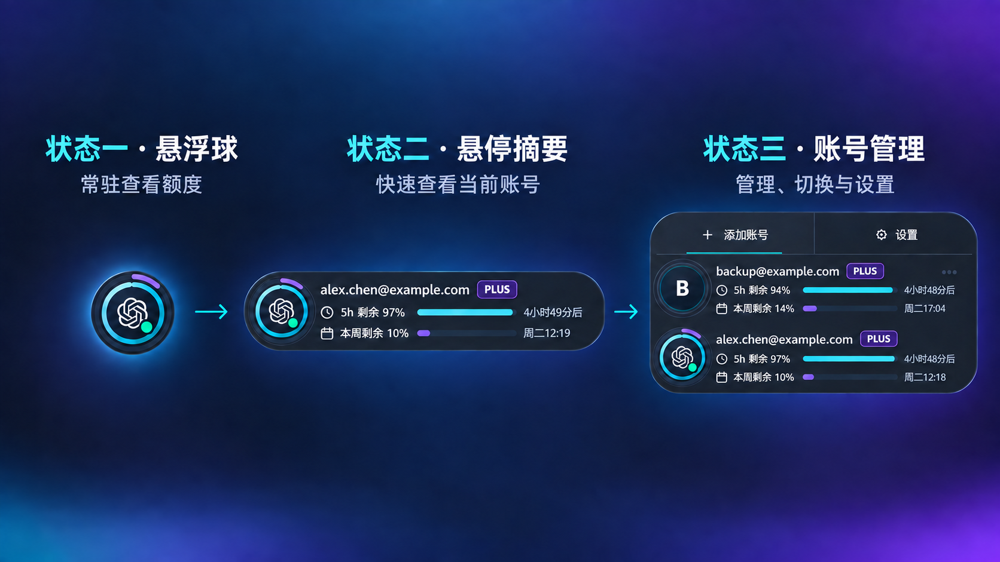

# Codex Account Manager — MVP 需求与实现方案

> 文档状态：V1
>
> 当前平台：Windows 10 / Windows 11
>
> 技术栈：Tauri 2 + Vue 3 + TypeScript + Rust

## 1. 产品目标

Codex Account Manager 是一个常驻桌面的轻量工具，用于解决两个核心问题：

1. 同时查看多个个人 ChatGPT/Codex 账号的剩余用量，兼容 Plus、Pro 等套餐。
2. 手动切换当前 Codex Desktop 使用的账号，避免额度耗尽后重复退出、打开网页并重新授权。

MVP 必须优先保证账号凭据安全、用量数据准确、切换可回滚。首版不实现自动切换账号。

## 2. 已确认的技术基础

- Codex 本地 `app-server` 可以通过标准输入输出提供 JSON-RPC 接口。
- `account/read` 可以读取账号邮箱、账号类型和 `planType`。
- `account/rateLimits/read` 可以读取额度池、已使用百分比、窗口长度和重置时间。
- 当前环境已验证能够读取 Plus 账号的 5 小时和一周额度。
- Windows 上 Codex 的当前登录态位于 `%USERPROFILE%\.codex\auth.json`。
- Codex Desktop 和 Codex CLI 可能共用同一份登录态，切换时必须协调相关进程。

实现不得依赖 ChatGPT 网页私有接口、Cookie 抓取或页面自动化。

## 3. MVP 功能范围

### 3.1 包含

- 导入当前 Codex 登录账号。
- 通过浏览器授权添加其他账号。
- 安全保存多个账号登录态。
- 查看每个账号的套餐、5 小时额度、一周额度和重置时间。
- 后台定时刷新、手动刷新和失败重试。
- 三种悬浮界面状态。
- 手动切换当前 Codex Desktop 账号。
- 切换过程中的进程关闭、重新启动、结果验证和失败回滚。
- 托盘图标、开机启动、置顶和悬浮球位置记忆。
- 数据过期、认证失效和切换失败状态。

### 3.2 暂不包含

- 额度耗尽后自动切换账号。
- 同时运行多个不同账号的 Codex Desktop。
- API 计费账户或组织账单统计。
- 长期用量趋势图和消耗预测。
- Linux 和 macOS 发布。
- 云端同步账号凭据。
- Mac App Store 或 Microsoft Store 发布。

## 4. 界面设计

审核通过的 V3 设计稿：



### 4.1 统一视觉规则

- 深色半透明玻璃表面，保持低干扰、高对比度。
- 内圈青色：5 小时剩余用量。
- 外圈紫色：一周剩余用量。
- 两个圆环都从 12 点方向顺时针绘制。
- 圆环显示剩余量，不显示已使用量。
- `remainingPercent = clamp(100 - usedPercent, 0, 100)`。
- 绿色状态点位于中心图标右下角、两个进度环内部，不得遮挡进度环。
- Plus、Pro 作为套餐标签展示，不为不同套餐硬编码不同计算方式。

### 4.2 状态一：常驻悬浮球

- 经 Windows 透明窗体实测，圆球收紧为 72 × 72 逻辑像素，实际窗口为 80 × 80；不使用超出圆球的阴影或滤镜，避免透明层出现矩形边缘。
- 中心显示产品图标。
- 内外两个 SVG 圆环精确反映当前账号剩余百分比。
- 右下角小圆点表示 Codex Desktop 进程状态：
  - 绿色：正在运行。
  - 灰色：未运行。
  - 黄色：正在切换或重启。
  - 红色：认证、启动或切换异常。
- 轻微呼吸效果：周期约 4 秒，最大缩放约 1.5%，光晕透明度变化控制在低强度范围。
- 进度环不得持续旋转，避免被误解为加载状态。
- 任意状态下按住鼠标右键拖动整个窗口；左键仅用于展开、收起和操作，避免拖动与点击相互抢占。
- 记录每个显示器和 DPI 下的位置。

### 4.3 状态二：悬停摘要

- 鼠标进入后由悬浮球向右展开；右侧空间不足时向左展开。
- 整体为左右完全对称的胶囊形状；根据 EXE 实测反馈，表面进一步收紧为 416 × 80 逻辑像素，窗口宽度为 424 px。
- 悬浮球完整包含在胶囊内部，不得突出窗口边界。
- 显示当前账号：
  - 邮箱或用户自定义别名。
  - Plus/Pro 套餐标签。
  - 5 小时剩余百分比和重置倒计时。
  - 一周剩余百分比和重置时间。
- 不显示冗余的“Codex 正在运行”文字；状态点提供 Tooltip。
- 进入动画约 180～220 ms；鼠标离开后延迟约 250～350 ms 收起。

### 4.4 状态三：账号管理器

- 点击状态一或状态二后进入。
- 与状态二保持相同宽度，底边和当前账号内容位置保持不动。
- 默认从状态二顶部向上增加高度；上方空间不足时向下展开。
- 整个界面必须是一个连续表面，不得出现分离面板、连接尾巴或额外悬浮球。
- 四个外角统一使用相同圆角半径，保持上下、左右对称。
- 顶部操作栏分为两个等宽区域：
  - 添加账号。
  - 设置。
- 其他账号位于当前账号上方。
- 当前账号始终位于底部，并保持状态二的视觉布局。
- 每个账号使用相同的三列网格：
  - 64 px 身份图标列。
  - 自适应账号和额度信息列。
  - 68 px 操作列。
- 邮箱、套餐、进度条、重置时间和按钮必须沿统一参考线对齐。
- 非当前账号显示“切换”，当前账号显示等尺寸的“当前”状态。
- 超过可显示账号数量时仅列表区域滚动，顶部操作栏和当前账号保持可见。
- 面板高度随账号数量自然增长：单账号只在状态二上方增加操作栏，不保留空的大面板；最多同时显示 3 个账号，更多账号进入滚动区。

### 4.5 窗口状态切换

Tauri 窗口应按真实界面大小调整，不能保留大面积透明点击区域：

- 状态一：缩小到悬浮球和阴影需要的尺寸。
- 状态二：根据展开方向调整宽度和 X 坐标。
- 状态三：根据展开方向调整高度和 Y 坐标。
- 向上展开时保持窗口底边固定：`newY = oldBottom - newHeight`。
- 位置和尺寸由单个 Rust 命令一次计算并提交，减少 JavaScript 连续调整产生的闪烁。
- 所有尺寸使用逻辑像素，并根据显示器缩放比例转换为物理像素。

## 5. 技术架构

```text
Vue 3 UI
├── FloatingOrb
├── HoverSummary
├── AccountPanel
├── AccountRow
└── SettingsView
        │ Tauri commands / events
Rust Core
├── AppServerClient
├── UsageService
├── AccountVault
├── SwitchEngine
├── CodexProcessManager
├── WindowGeometryManager
└── WindowsPlatform
```

### 5.1 前端

- Vue 3 Composition API。
- TypeScript 严格模式。
- Pinia 保存界面状态和不敏感的账号摘要。
- SVG 绘制额度圆环，CSS transition/animation 实现轻微动效。
- 前端不得接收或持久化 access token、refresh token 或完整 `auth.json`。
- 敏感操作只能通过受限的 Tauri command 调用 Rust 层。

### 5.2 Tauri 窗口

建议配置：

- `decorations: false`
- `transparent: true`
- `alwaysOnTop: true`
- `skipTaskbar: true`
- `resizable: false`
- `shadow: false`

悬浮窗之外另提供系统托盘菜单：显示/隐藏、立即刷新、添加账号、设置、退出。

### 5.3 Rust 核心

Rust 层负责：

- 查找 Codex 可执行文件。
- 管理 App Server 子进程和 JSON-RPC。
- 创建隔离账号环境。
- 使用 Windows DPAPI 加密和解密非活动账号凭据。
- 识别、关闭和重新启动 Codex Desktop。
- 原子替换当前 `auth.json`。
- 写入切换事务日志并在失败时回滚。
- 对日志进行敏感字段过滤。

## 6. 账号数据模型

```ts
interface ManagedAccount {
  id: string;                 // 稳定的 account_id，不使用邮箱作为主键
  email: string;
  alias?: string;
  planType?: "plus" | "pro" | string;
  isActive: boolean;
  credentialState: "valid" | "expired" | "missing";
  processState?: "running" | "stopped" | "switching" | "error";
  fiveHour?: QuotaWindow;
  weekly?: QuotaWindow;
  extraLimits?: QuotaWindow[];
  lastUpdatedAt?: number;
  lastError?: string;
}

interface QuotaWindow {
  limitId: string;
  usedPercent: number;
  remainingPercent: number;
  windowDurationMins: number;
  resetsAt?: number;
}
```

邮箱允许变化，也可能出现重复显示名称，因此内部身份必须使用账号 ID。

## 7. 用量查询实现

### 7.1 App Server 启动

优先从以下位置发现 Codex：

1. 已知的 Codex Desktop 安装目录。
2. `%LOCALAPPDATA%\OpenAI\Codex\bin`。
3. 系统 `PATH`。

启动参数：

```text
codex app-server --listen stdio://
```

客户端流程：

1. 启动子进程并连接标准输入输出。
2. 发送 `initialize`。
3. 收到响应后发送 `initialized` 通知。
4. 调用 `account/read`。
5. 调用 `account/rateLimits/read`。
6. 正常关闭子进程；异常时结束对应进程树。

单次请求超时建议 12 秒，失败后重建子进程并重试一次。

### 7.2 额度解析

- 优先读取 `rateLimitsByLimitId["codex"]`。
- 不假设 `primary` 和 `secondary` 的顺序固定。
- 根据 `windowDurationMins` 匹配窗口：
  - 300 分钟：5 小时窗口。
  - 10080 分钟：一周窗口。
- 未识别的额度池保存到 `extraLimits`，MVP 可在详情中隐藏。
- 缺失额度显示“暂无数据”，不得显示为 0%。
- `resetsAt` 按本地时区显示，并同时计算友好的倒计时。

### 7.3 多账号刷新

- 所有账号通过一个全局队列串行刷新，禁止并发启动大量 App Server。
- 默认每 5 分钟刷新一次。
- 打开账号面板时，如果缓存超过 60 秒则触发后台刷新。
- 支持手动刷新。
- 单个账号失败不得阻塞其他账号。
- 失败时保留最后一次成功数据，并显示“离线”或“更新于 N 分钟前”。

活动账号使用主 Codex Home 查询，不在监控过程中替换主 `auth.json`。非活动账号使用短期隔离目录查询。

## 8. 添加账号

添加账号不得影响当前正在使用的 Codex 账号：

1. 创建一次性隔离目录并设置独立 `CODEX_HOME`。
2. 强制该隔离环境使用文件型登录态存储。
3. 启动 App Server。
4. 调用 `account/login/start`，登录类型为 ChatGPT 浏览器授权。
5. 使用系统默认浏览器打开返回的 `authUrl`。
6. 等待 `account/login/completed` 通知。
7. 调用 `account/read` 和 `account/rateLimits/read` 完成身份确认。
8. 用 DPAPI 加密登录态并保存到账号仓库。
9. 安全清理隔离目录中的明文文件。

同一账号重复添加时，根据账号 ID 提示覆盖、更新或取消。

等待授权状态内嵌在顶部“添加账号”区域并提供取消操作，不得以悬浮提示条遮挡账号内容；授权完成或取消后必须立即清除等待状态。

## 9. 凭据存储

建议应用数据目录：

```text
%LOCALAPPDATA%\CodexAccountManager\
├── settings.json
├── accounts.json                 # 不含 token
├── accounts\
│   └── <account-id>\credential.bin
├── usage-cache.json              # 仅额度摘要
├── switch-journal.json           # 仅事务阶段和账号 ID
├── logs\app.log                  # 已脱敏
└── temp\<operation-id>\          # 操作完成后删除
```

安全规则：

- 非活动账号登录态使用 Windows DPAPI CurrentUser 加密。
- 当前活动账号仍必须以 Codex 可读取的格式存在于 `%USERPROFILE%\.codex\auth.json`；这是唯一允许的长期明文副本。
- 明文临时文件使用限制性 ACL，并在 App Server 退出后立即删除。
- 任何日志、错误对象和前端事件都不得包含 token。
- 禁止将凭据写入 Pinia、localStorage、崩溃报告或剪贴板。
- 切换器只管理 `auth.json`，不重建整个 `.codex` 目录，也不修改用户的配置、技能、历史和项目数据。
- Windows 首版不使用符号链接。

## 10. 手动切换账号

### 10.1 用户流程

1. 用户在账号面板点击目标账号的“切换”。
2. 如果 Codex Desktop 正在运行，提示切换会关闭并重新启动 Codex，可能中断进行中的任务。
3. 用户确认后，界面锁定账号操作，状态点变为黄色。
4. 显示阶段状态：保存当前账号、关闭 Codex、应用目标账号、启动 Codex、验证账号。
5. 成功后目标账号变为“当前”，状态点恢复绿色。
6. 失败时自动恢复原账号，并显示可操作的错误信息。

### 10.2 Switch Engine

```text
Acquire global switch lock
    ↓
Detect Codex Desktop / CLI processes
    ↓
Gracefully close Codex Desktop
    ↓ timeout
Kill only the verified Codex package process tree if required
    ↓
Read latest active auth.json and encrypt it into the outgoing account vault
    ↓
Write switch journal: prepared
    ↓
Decrypt target credential to auth.json.switching
    ↓
Flush file and atomically replace main auth.json
    ↓
Write switch journal: replaced
    ↓
Launch Codex Desktop
    ↓
Call account/read and verify target account_id
    ↓ success                 ↓ failure
Commit and clear journal     Restore outgoing credential and relaunch
```

进程识别必须结合可执行文件路径、安装包位置和产品信息，禁止直接结束系统内所有 `ChatGPT.exe`。

事务日志不得包含登录态，只记录源账号 ID、目标账号 ID、阶段、时间和恢复信息。应用启动时发现未完成事务，应先执行恢复检查。

## 11. 异常处理

| 场景 | 行为 |
|---|---|
| App Server 无法启动 | 保留缓存，显示离线，允许重新定位 Codex |
| 单个账号授权过期 | 标记“需要重新登录”，不影响其他账号 |
| 网络不可用 | 保留最后成功数据和更新时间 |
| 额度字段缺失 | 显示暂无数据，不按 0% 处理 |
| Codex 无法正常退出 | 超时后只结束已验证的 Codex 进程树 |
| 原子替换失败 | 不启动目标账号，保持或恢复源账号 |
| 启动后账号验证失败 | 自动回滚并重新启动原账号 |
| 应用在切换中崩溃 | 下次启动读取事务日志并恢复 |
| 临时目录残留 | 启动时清理不属于活动操作的过期目录 |

## 12. 建议代码结构

```text
CodexAccountManager\
├── design\
│   ├── app-icon.svg
│   └── codex-account-manager-ui.png
├── scripts\
│   ├── build-release.cmd
│   └── cargo-msvc.cmd
├── src\
│   ├── components\
│   │   ├── HoverSummary.vue
│   │   ├── AccountPanel.vue
│   │   ├── AccountRow.vue
│   │   ├── QuotaRows.vue
│   │   ├── QuotaRing.vue
│   │   └── SettingsView.vue
│   ├── stores\accounts.ts
│   ├── types\account.ts
│   └── App.vue
├── src-tauri\
│   └── src\
│       ├── app_server.rs
│       ├── vault.rs
│       ├── process_manager.rs
│       ├── settings.rs
│       ├── commands.rs
│       ├── models.rs
│       ├── lib.rs
│       └── main.rs
├── README.md
└── MVP.md
```

## 13. 开发顺序

### 阶段一：基础工程和静态界面

- 创建 Tauri 2 + Vue 3 + TypeScript 项目。
- 实现 V3 三种状态和窗口几何变化。
- 使用模拟账号数据完成圆环、列表和动画。

### 阶段二：当前账号用量

- 实现 App Server JSON-RPC 客户端。
- 读取当前账号身份、套餐和额度。
- 加入缓存、刷新、超时和离线状态。

### 阶段三：多账号仓库

- 导入当前账号。
- 实现隔离浏览器登录。
- 实现 DPAPI 加密存储和非活动账号串行查询。

### 阶段四：安全切换

- 实现进程识别和正常退出。
- 实现事务日志、原子替换、重启验证和回滚。
- 对关键阶段注入失败并测试恢复能力。

### 阶段五：产品化

- 托盘、开机启动、设置和位置记忆。
- 多显示器、125%/150%/200% DPI 测试。
- MSI/NSIS 安装包、签名和升级策略。

### 当前实现状态（2026-09-09）

- 阶段一至阶段四的 MVP 主流程已落地，界面直接使用真实账号数据，不注入模拟账号。
- 阶段五已实现系统托盘、设置页、开机启动选项，以及按显示器和 DPI 保存悬浮球位置；完整多显示器回归仍需持续测试。
- 当前仅生成 `src-tauri/target/release/codex-account-manager.exe`，不在项目根目录复制产物，暂不制作安装包、不签名。
- 已加入额度换算、账号目录名清理和 Windows DPAPI 加解密单元测试；破坏性故障注入与真实多账号端到端回归仍需在测试账号环境执行。

## 14. MVP 验收标准

- 至少可以保存并展示 3 个 Plus/Pro 账号。
- 所有账号均能读取 5 小时、一周额度和重置时间；单账号失败不影响其他账号。
- 圆环弧长与显示百分比一致，误差仅来自像素取整。
- 三种状态转换连贯，状态三从状态二向上或向下展开，不产生大面积透明点击区域。
- 在多显示器和常见 DPI 下不越出工作区。
- 切换目标账号后，Codex Desktop 重新启动且 `account/read` 返回目标账号 ID。
- 在关闭失败、写文件失败、启动失败和验证失败时能够恢复原账号。
- 除 Codex 自身要求的当前 `auth.json` 外，不存在长期明文账号凭据。
- 日志、缓存、前端状态和错误消息中不出现 access token 或 refresh token。
- 应用空闲时资源占用保持轻量，不进行高频网络轮询。

## 15. 参考实现

- Codex App Server：<https://learn.chatgpt.com/docs/app-server>
- CodexBar：<https://github.com/steipete/CodexBar>
- Windows CodexBar：<https://github.com/jspann21/codex-bar>
- 简单账号快照切换器：<https://github.com/Sls0n/codex-account-switcher>

开源项目仅用于参考交互和架构。复制实现前必须检查许可证；没有明确许可证的仓库不得直接复制代码。
